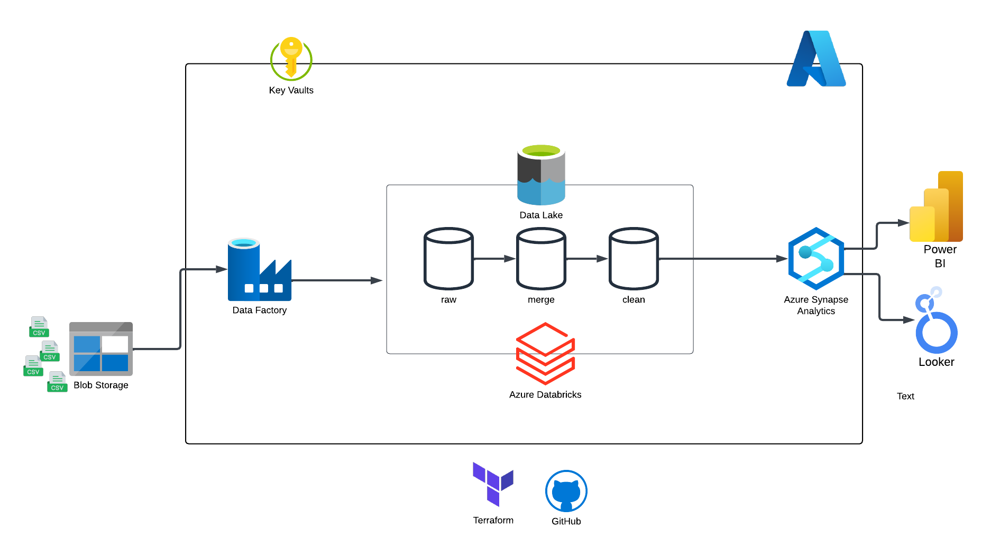

# Guayerd-IBM-Data

## Tecnologias usadas

- Python
- SQL / MySQL
- [Beekeeper Studio](https://www.beekeeperstudio.io/)
- [Docker](https://www.docker.com/)
- [Terraform](https://www.terraform.io/)
- Azure
- Excel / Google Sheets
- Looker Studio

## Azure pipeline

- Dashboard en Looker

[Dashboard](https://lookerstudio.google.com/u/0/reporting/91a40e92-eb80-4d9b-b6a9-88db2b82c413/page/p_j9ieyp3vmd)

---

- Pipeline en Azure gestionada con terraform WIP
